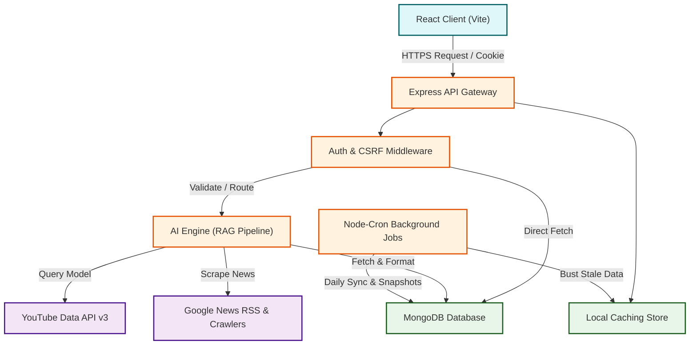

# SocialIQ — Enterprise AI Political Intelligence Platform

<p align="center">
  
</p>

<p align="center">
  <b>AI-powered political intelligence, YouTube analytics, real-time monitoring, and research platform for journalists, analysts, political researchers, campaign teams, and organizations.</b>
</p>

<p align="center">
  <a href="https://github.com/PallavSarkar2005/Social-Analysis/actions"></a>
  <a href="https://github.com/PallavSarkar2005/Social-Analysis/releases"></a>
  <a href="https://nodejs.org"></a>
  <a href="https://react.dev"></a>
  <a href="https://www.mongodb.com"></a>
  <a href="https://github.com/PallavSarkar2005/Social-Analysis/blob/main/LICENSE"></a>
</p>

---

## 2. Demo & Preview

| Interactive Modules | Real-time AI Intelligence | Dynamic Analysis |
| :---: | :---: | :---: |
| [Live Website Link](https://social-iq.railway.app) | [Watch Explainer Video](https://youtube.com/watch?v=placeholder) | [Read Case Study](https://github.com/PallavSarkar2005/Social-Analysis/wiki) |

> [!NOTE]
> Below are production mockups of the SocialIQ Platform interface.

<p align="center">
  <b>Enterprise Dashboard Overview</b><br/>
  
</p>

---

## 3. Overview

**SocialIQ** is a state-of-the-art, enterprise-grade AI Political Intelligence and Social Analytics platform. In the modern era, digital footprints on platforms like YouTube and X (Twitter) drive public opinion, political narratives, and election strategies. SocialIQ digests high-throughput media metrics, news updates, and historic election data, running them through specialized AI pipelines to deliver deep research profiles.

### The Problem It Solves
- **Information Fragmentation:** Researchers and journalists spend hours aggregating data across YouTube channels, news feeds, past elections, and social accounts.
- **Narrative Manipulation & Sentiment Shifts:** Detecting coordinated campaign messaging and structural changes in political messaging requires real-time monitoring and natural language parsing.
- **Stale Social Statistics:** Standard analytics tools focus on business KPIs (e.g., conversions) rather than political topics, geographic reach, or influence networks.

### Why It Is Critical
By utilizing a hybrid **RAG (Retrieval-Augmented Generation)** framework backed by Groq and OpenAI, SocialIQ acts as an automated researcher. It retrieves video transcripts, sentiment indicators, and media logs, generating structured biographies, geographic influence maps, and campaign strategy insights in seconds.

### Target Users
- 📰 **Journalists & News Agencies:** Validate narrative timelines and gather real-time data for investigative reporting.
- 🔬 **Political Researchers & Analysts:** Compile comprehensive briefs on political figures and track campaign groups.
- 📣 **Campaign Managers & Strategists:** Run competitor benchmarking, monitor voter sentiment, and evaluate outreach metrics.
- 🏛️ **Government & Non-Profit Organizations:** Study evolving political polarization and misinformation vectors across states.

---

## 4. Features

| Feature | Sub-components & Capabilities | Security / Performance |
| :--- | :--- | :--- |
| **Enterprise Authentication** | Google OAuth 2.0 Integration, Multi-device session controls, Auto-refresh JWT tokens, Remember Me cookie engine. | CSRF double-cookie submit tokens, rate-limited login endpoints, Mongo Sanitization against Injection. |
| **Robust Image Upload** | Custom JPG/PNG/WEBP upload handler up to 5MB, static thumbnail routing, profile picture integration. | Express Multer engine, automatic fallback to default profile cards on upload failure. |
| **YouTube Media Analyzer** | Video statistical auditing, channel narrative tracking, automatic database snapshot storage. | Intelligent Cache layer bypassing live API limits, dynamic refresh controls. |
| **Political Intelligence Profiles** | News aggregation, bio summaries, timeline milestones, election history tracking, influence matrix. | Hybrid RAG Pipeline utilizing Groq with OpenAI high-performance fallback models. |
| **State & Party Analytics** | Interactive India Maps, regional density analytics, party alignment tracking. | React Query pre-fetching, lazy-loaded interactive SVG modules. |
| **Auditing & Control** | Platform Audit Logs, developer API keys engine, user account settings dashboard. | Cryptographic hash checking, high-speed read/write optimizations. |

---

## 5. Tech Stack

| Layer | Technology | Primary Purpose |
| :--- | :--- | :--- |
| **Frontend** | React (v18.3), Vite | Fast, modern client execution |
| **Styling & UI** | Vanilla CSS, Framer Motion | Custom Glassmorphism design system & micro-animations |
| **State & Cache** | React Query (TanStack), Axios | Global client state caching & request synchronization |
| **Charts** | Chart.js, React-Chartjs-2 | Visualizing metric history, sentiment, and subscriber logs |
| **Backend** | Node.js, Express.js | High-concurrency REST API gateway & service execution |
| **Database** | MongoDB, Mongoose | Persistent document model store |
| **Authentication** | JWT (Access & Refresh), Google OAuth | State-free session controls & third-party onboarding |
| **AI Processing** | Groq (Llama-3), OpenAI (GPT-4o) | High-speed semantic extraction & Biography formulation |
| **APIs Integrated** | YouTube Data API v3, Google News RSS | External media metrics and article feeds |
| **Security Packages** | Helmet, Express Rate Limit, XSS-Clean | API shielding, injection blocking, and access gating |
| **Testing** | Jest, Supertest, Playwright | Unit, integration, and end-to-end browser verification |

---

## 6. System Architecture



---

## 7. Folder Structure

```text
SocialIQ/
├── backend/                       # Express Node.js Server Environment
│   ├── config/                    # Database, environmental, and module config setup
│   ├── controllers/               # Business logic handlers (auth, accounts, profile, media)
│   ├── jobs/                      # Background schedulers (Node-cron snapshot updates)
│   ├── middleware/                # Security filters (CSRF, XSS, rate-limit, session validation)
│   ├── models/                    # Mongoose database collection structures
│   ├── routes/                    # API route endpoints configuration mapping
│   ├── scrapers/                  # Custom RSS and web extraction modules
│   ├── services/                  # Business services (AI client pipelines, email delivery)
│   ├── tests/                     # Jest API testing configurations & mocks
│   ├── uploads/                   # Statically served local profile photos
│   ├── utils/                     # Encryption, helper functions, and schema validators
│   └── server.js                  # Main server entrypoint
│
├── frontend/                      # React SPA Codebase
│   ├── public/                    # Static assets, SVG maps, and placeholders
│   └── src/                       # Main application workspace
│       ├── api/                   # Axios HTTP requests definitions
│       ├── assets/                # Styling variables, local images
│       ├── components/            # UI components (CreatorCard, IndiaMap, Navbar, Sidebar)
│       ├── context/               # Global states providers (AuthContext, ThemeContext)
│       ├── hooks/                 # Custom reusable React hooks
│       ├── pages/                 # Layout views (Compare, Dashboard, Profile, Settings)
│       ├── utils/                 # Frontend helpers and validators
│       ├── App.jsx                # Main App Router and CSRF initialization
│       └── main.jsx               # Render hook
│
└── README.md                      # Developer documentation
```

---

## 8. Installation Guide

### Prerequisites
- **Node.js** v20.x or higher
- **MongoDB** v6.x or higher running locally or a MongoDB Atlas URI
- Access to **YouTube Data API v3** keys

### Step 1: Clone the Repository
```bash
git clone https://github.com/PallavSarkar2005/Social-Analysis.git
cd Social-Analysis
```

### Step 2: Configure the Backend Environment
1. Navigate into the backend workspace:
   ```bash
   cd backend
   ```
2. Install dependencies:
   ```bash
   npm install
   ```
3. Create a `.env` file in the `backend/` directory by copying `.env.example`:
   ```bash
   cp .env.example .env
   ```

### Step 3: Configure the Frontend Environment
1. Navigate to the frontend workspace (from root):
   ```bash
   cd ../frontend
   ```
2. Install client dependencies:
   ```bash
   npm install
   ```

### Step 4: Run the Application Locally
Run the server and the front-end application in parallel:

*   **To run the Backend Server:**
    ```bash
    cd backend
    npm run dev
    ```
*   **To run the Frontend Client:**
    ```bash
    cd frontend
    npm run dev
    ```

The client will start on `http://localhost:5173`, and the server will execute on `http://localhost:5000`.

---

## 9. Environment Variables

Create your backend `.env` file containing the following variables:

| Variable Name | Required / Optional | Description | Default / Example Value |
| :--- | :--- | :--- | :--- |
| `PORT` | Required | Express API execution port | `5000` |
| `MONGO_URI` | Required | Connection string to MongoDB instance | `mongodb://localhost:27017/socialiq` |
| `JWT_SECRET` | Required | Session access token cryptographic secret | `super_secret_access_key_2026` |
| `JWT_REFRESH_SECRET` | Required | Session refresh token cryptographic secret | `super_secret_refresh_key_2026` |
| `GOOGLE_CLIENT_ID` | Optional | Google OAuth app client identifier | `your-google-client-id.apps.googleusercontent.com` |
| `GOOGLE_CLIENT_SECRET`| Optional | Google OAuth app secret | `GOCSPX-your-google-client-secret` |
| `OPENAI_API_KEY` | Required | Primary API key for LLM Biography operations | `sk-proj-...` |
| `GROQ_API_KEY` | Optional | High-performance sub-100ms LLM executor | `gsk_...` |
| `YOUTUBE_API_KEY` | Required | Primary YouTube Data API v3 token | `AIzaSy...` |
| `YOUTUBE_API_KEY_2` | Optional | Fallback YouTube token to handle quota limits | `AIzaSy...` |
| `EMAIL_HOST` | Optional | SMTP Mail Host for notification dispatches | `smtp.gmail.com` |
| `EMAIL_PORT` | Optional | SMTP TLS Mail Port | `587` |
| `EMAIL_USER` | Optional | SMTP sender address login credentials | `noreply.socialiq@gmail.com` |
| `EMAIL_PASS` | Optional | SMTP app password | `your-smtp-app-password` |
| `SESSION_SECRET` | Required | Express-session encryption key | `session_encryption_cookie_secret` |
| `CLIENT_URL` | Required | Allowed CORS origin client url | `http://localhost:5173` |
| `SERVER_URL` | Required | Backend API Base URL | `http://localhost:5000` |
| `RAZORPAY_KEY_ID` | Optional | Razorpay key identifier for payments | `rzp_test_...` |
| `RAZORPAY_SECRET` | Optional | Razorpay client payment signing secret | `your-razorpay-secret` |
| `UPLOAD_PATH` | Optional | Path to write uploaded files to | `./uploads/` |

---

## 10. Authentication Flow

SocialIQ relies on a secure **hybrid token/cookie mechanism** for authorization:

```text
  [ Client Application ]                          [ Express Backend ]
          |                                               |
          |---- 1. Submit Login Credentials ------------->|
          |<--- 2. Write Refresh Token HTTPOnly Cookie ----| (SameSite=Strict, Secure)
          |<--- 3. Send Access Token (JSON Body) ---------|
          |                                               |
          |---- 4. GET /api/accounts (Bearer Auth) ------>| (Authenticated Request)
          |                                               |
  (Token Expires)                                         |
          |---- 5. POST /api/auth/refresh -------------->| (Silent auto-refresh)
          |<--- 6. Return New Access Token ---------------|
```

1. **Registration:** Account creation sets defaults: `isVerified: true` and `isEmailVerified: true` (bypassing verification email delays in developer mode).
2. **Login:** Validate email/password, issue high-expiry Refresh Token in an `HTTPOnly` cookie, and return a short-lived `AccessToken` (Bearer JWT) in the JSON payload.
3. **Silent Refresh:** Axios interceptors intercept expired request failures (401), automatically triggering `/api/auth/refresh` to refresh the session seamlessly.
4. **Google OAuth:** Resolves user profiles through tokens and automatically creates the user record if it doesn't exist.
5. **CSRF Shielding:** Initiates a double-cookie handshake, validation occurs via customized headers (`X-CSRF-Token`).

---

## 11. Analyzer Workflow

```text
[User input: YouTube URL] ➔ [Optional Image Upload] ➔ [Select Party / State]
                                                               ⬇
[Dynamic Cache Lookup] ➔ IF Cached ➔ [Load Stale Snapshots] ➔ [Dashboard Display]
      ⬇
   IF NOT Cached
      ⬇
[YouTube Data API v3 Hit] ➔ [Retrieve Channel Stats & Metadata]
                                                               ⬇
[Save Snapshot Collection] ➔ [Mongoose Record Created] ➔ [Update AI Pipeline]
                                                               ⬇
                                                      [Dashboard Refreshed]
```

---

## 12. Political Intelligence Workflow

For any creator tracked within SocialIQ, a profile is built via the following automated pipeline:
1. **Biography Formulation:** Raw channel details and video metrics are processed via the LLM API to write a structured summary.
2. **Election History Logs:** Historical voting records and district outcomes are cross-referenced with the candidate or channel owner.
3. **Google News Crawler:** Scrapes real-time headlines linked to the creator's name.
4. **Sentiment scoring:** Extracts sentiment trends (positive, neutral, negative) from headlines.
5. **Geographic Mapping:** Determines where the creator holds the greatest influence, plotting density maps directly on an interactive map.

---

## 13. AI Pipeline & RAG Infrastructure

```text
                     [ User Question / Profile Request ]
                                    ⬇
 [ Database Query: Channel Stats + Scraped News + Election Histories ]
                                    ⬇
 [ Context Assembly: Format metrics, news text, and history into prompt ]
                                    ⬇
       [ Execute LLM Request (Groq Llama-3-70b-8192 API) ]
         ⬇                                         ⬇
(If Success)                               (If Failure / Quota Limit)
         ⬇                                         ⬇
[Output Response]                         [Fallback: OpenAI GPT-4o API]
                                                   ⬇
                                            [Output Response]
```

*   **Streaming Support:** Emits responses chunk-by-chunk for an interactive client experience.
*   **Result Caching:** Stores formulated summaries locally in MongoDB, bypassing redundant model evaluations.

---

## 14. Dashboard Modules

- **Dashboard:** Unified dashboard displaying metrics (Total Reach, Engagement, Active Channels).
- **Analyzer:** Live input engine supporting custom image overrides, state metadata, and quick uploads.
- **Tracked Nodes:** A list containing all monitored creators with synchronized profile cards.
- **Creator Compare:** Benchmarks up to 3 creators side-by-side on subscriber progression, engagement, and post rates.
- **Competitors:** Automated mapping displaying competing channels within the same state/party.
- **Snapshot History:** Detailed historical record of audited statistics over time.
- **Reports:** Interactive PDF and Excel exports detailing audit logs and engagement statistics.
- **AI Strategy:** Generates personalized political campaign strategies using context-aware LLM pipelines.
- **Political Profiles:** Deep-dives into individual profiles (Sentiment Charts, Election Histories, News feeds).
- **Settings:** API key controls, platform profiles, and session authorization management.
- **Billing:** Package tier settings (Free, Professional, Enterprise) using Razorpay integrations.
- **Developer Keys:** Manages REST keys to fetch SocialIQ metrics directly via external scripts.
- **Audit Logs:** System-wide security logs recording profile updates, user logins, and administrative actions.

---

## 15. Security Hardening

SocialIQ is engineered to defend against threats outlined in the OWASP Top 10:

- **NoSQL Injection Shielding:** Express Mongo Sanitize filters out request fields beginning with `$` or `.`.
- **XSS Protection:** Custom parser runs `xss-clean` across request parameters and payload strings to sanitize scripts and HTML tags.
- **HTTP Header Hardening:** Uses Helmet middleware to enforce secure HTTP headers (HSTS, Content Security Policy, Frame Options).
- **Strict Rate Limiting:** Limits endpoints (like `/api/auth/login`) to a maximum of 100 requests per 15 minutes per IP.
- **CSRF Protection:** Validates state-changing requests (POST, PUT, DELETE) against unique tokens.
- **Password Hashing:** Uses `bcryptjs` (salt rounds: 10) to store passwords securely.

---

## 16. Performance Optimizations

```text
[ Client Requests ]
        ⬇
 [ React Query Cache ] ➔ (Hit) ➔ [ Return Stored UI State (0ms) ]
        ⬇ (Miss)
 [ Express Server ]
        ⬇
 [ MongoDB Indices ] ➔ (Hit) ➔ [ Fetch Indexed Record (5ms) ]
```

1. **React Query:** Eliminates redundant API calls by caching responses and synchronizing updates across pages.
2. **Dynamic Lazy Loading:** Code-splits routes, mounting views only when needed to optimize bundle sizes.
3. **Request Deduplication:** Merges identical API queries triggered in parallel into a single flight.
4. **Database Indexing:** Index structures created on `accountId`, `platform`, and `state` ensure fast retrieval as the dataset grows.
5. **Image Cache Busting:** Automatically appends timestamps (`?t=timestamp`) to uploaded profile images to bypass browser cache issues.

---

## 17. Testing Suite

The codebase undergoes automated tests to ensure API reliability:

- **Integration Testing:** Uses Jest and Supertest to verify routes (Auth, Account Management, Security, Profile endpoints).
- **Syntax Check:** Restricts execution constraints using strict environment checkers.

### Running Backend Tests
Execute the integration test suite:
```bash
cd backend
$env:NODE_OPTIONS="--experimental-vm-modules"; npx jest tests/api.test.js --runInBand
```

---

## 18. API Reference

### Authentication Routes

| HTTP Verb | Endpoint | Authentication | Description |
| :--- | :--- | :--- | :--- |
| `POST` | `/api/auth/register` | Public | Create new user profile |
| `POST` | `/api/auth/login` | Public | Authenticate user, issue cookies & tokens |
| `POST` | `/api/auth/logout` | Session Token | Terminate session, invalidate cookies |
| `GET` | `/api/auth/me` | Bearer Token | Fetch authenticated user profile data |
| `POST` | `/api/auth/refresh` | HTTPOnly Cookie | Invalidate access token, issue new token |

### Media Analyzer Routes

| HTTP Verb | Endpoint | Authentication | Description |
| :--- | :--- | :--- | :--- |
| `GET` | `/api/accounts` | Bearer Token | Fetch all monitored channel accounts |
| `POST` | `/api/accounts` | Bearer Token | Store a new YouTube or X profile node |
| `DELETE`| `/api/accounts/:id` | Bearer Token | Untrack and remove creator node |
| `POST` | `/api/analyzer/youtube`| Bearer Token | Analyze YouTube URL, retrieve channel statistics |
| `POST` | `/api/media/upload` | Bearer Token | Upload JPG/PNG/WEBP custom thumbnail |

### Political Profiles Routes

| HTTP Verb | Endpoint | Authentication | Description |
| :--- | :--- | :--- | :--- |
| `GET` | `/api/profile/:accountId` | Bearer Token | Fetch Biography & State information |
| `GET` | `/api/profile/:accountId/timeline` | Bearer Token | Fetch leader timeline milestones |
| `GET` | `/api/profile/:accountId/news` | Bearer Token | Crawl Google News & analyze sentiment |
| `GET` | `/api/profile/:accountId/elections`| Bearer Token | Fetch historic election performance data |
| `GET` | `/api/profile/:accountId/influence`| Bearer Token | Fetch geographic reach coordinates |

---

## 19. Future Roadmap

- [ ] **Automated Payments Integration:** Fully enable production billing tier subscriptions using Stripe.
- [ ] **Expanded Platform Trackers:** Integrate custom Twitter/X API scrapers, Instagram, and Facebook campaign monitoring.
- [ ] **Election Prediction Engine:** Feed historical voting logs, demographic data, and social media sentiment into machine learning models to forecast outcomes.
- [ ] **Infrastructure Containerization:** Fully containerize the app using Docker and Kubernetes to simplify multi-region deployments.
- [ ] **Redis Caching Integration:** Implement Redis to manage real-time session stores and high-frequency rate-limits.
- [ ] **Mobile Application:** Package frontend code using React Native to support mobile views.

---

## 20. Screenshots & Visuals

Here is a preview of the main modules inside the running application:

| Feature Screen | Description | Path Location |
| :--- | :--- | :--- |
| **Creator Analysis Profile** | Displays full biography, timeline tracker, and RSS feeds | [PoliticalProfile.jsx](file:///frontend/src/pages/PoliticalProfile.jsx) |
| **Regional Reach Mapping** | SVG State Map visualizing creator influence | [IndiaMap.jsx](file:///frontend/src/components/common/IndiaMap.jsx) |
| **Side-by-Side Compare** | Dual chart comparison for channel performance | [Compare.jsx](file:///frontend/src/pages/Compare.jsx) |

---

## 21. Contributing

We welcome contributions from researchers, software developers, and analysts. Please review our workflow:

1. **Fork the Repository** on GitHub.
2. **Create a Feature Branch:** `git checkout -b feature/amazing-new-module`
3. **Commit your modifications:** Write clean, descriptive commit messages matching project standards.
4. **Push the branch:** `git push origin feature/amazing-new-module`
5. **Open a Pull Request:** Describe the changes made and link any related issues.

---

## 22. License

Distributed under the MIT License. See [LICENSE](file:///LICENSE) for details.

---

## 23. Author

Created and Maintained by [Pallav Sarkar](https://github.com/PallavSarkar2005).

For feedback or enterprise queries, reach out at `pallavsarkar.contact@gmail.com`.

---

## 24. Acknowledgements

- [React](https://react.dev) — Component library framework.
- [Express](https://expressjs.com) — Backend API router framework.
- [MongoDB](https://www.mongodb.com) — Document storage database.
- [Groq](https://groq.com) — Fast Llama models execution.
- [OpenAI](https://openai.com) — Advanced GPT language models.
- [Chart.js](https://www.chartjs.org) — Performance metrics visualizations.
- [Framer Motion](https://www.framer.com/motion/) — Fluid animations.

---

<p align="center">
  <b>Built with ❤️ for Political Intelligence, Research, and AI-powered Analytics.</b>
</p>
