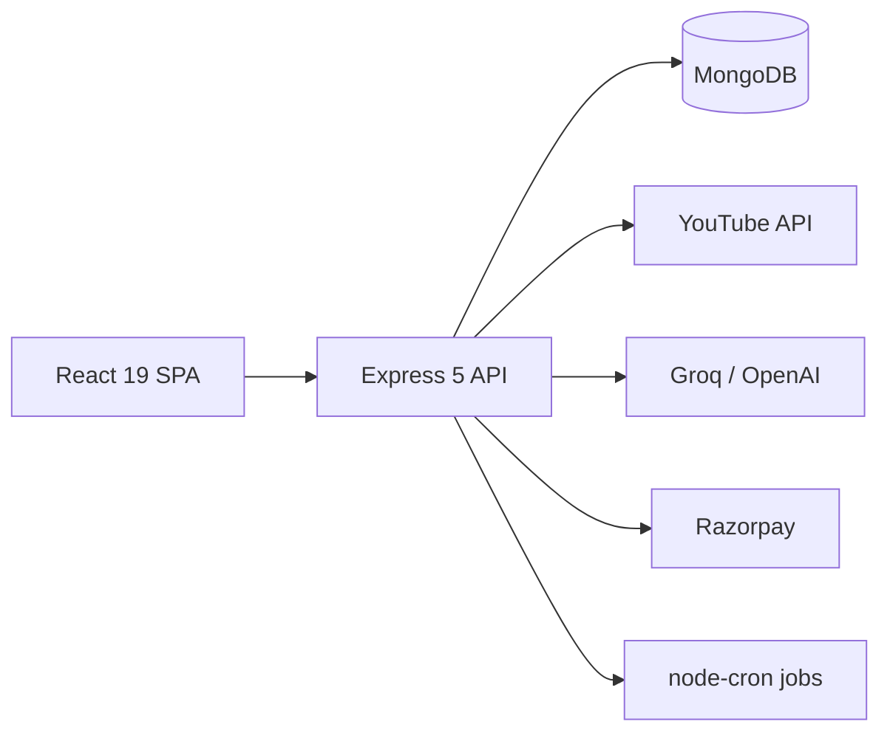

# SocialIQ — Enterprise AI Political Intelligence Platform

<p align="center">
  <b>AI-powered political intelligence, YouTube analytics, research dossiers, and subscription billing for journalists, analysts, and campaign teams.</b>
</p>

<p align="center">
  
  
  
  
  
</p>

---

## Project Description

**SocialIQ** (this repository: **Social-Analysis**) is a full-stack platform that:

- Tracks YouTube (and X) political creators with automated sync and analytics snapshots  
- Builds **political intelligence profiles** (biography, timeline, elections, influence, news sentiment)  
- Runs **AI insights and chat** (Groq primary, OpenAI fallback) with database-grounded context  
- Stores an **Intelligence Hub** of shareable/exportable reports  
- Monetizes via **Razorpay** subscriptions (INR + 18% GST) with plan quotas  

Live frontend (production): configured for Vercel · API: Railway (Nixpacks).

---

## Screenshots

> Place production screenshots under `docs/assets/` and link them here.

| Dashboard | Political Profile | Intelligence Hub |
| :---: | :---: | :---: |
|  |  |  |

---

## Architecture


```mermaid
flowchart LR
  Browser[React 19 SPA] --> API[Express 5 API]
  API --> Mongo[(MongoDB)]
  API --> YT[YouTube API]
  API --> Groq[Groq / OpenAI]
  API --> RZP[Razorpay]
  API --> Jobs[node-cron jobs]
```

Full diagrams: [docs/Architecture.md](docs/Architecture.md)

| Layer | Stack (actual) |
|-------|----------------|
| Frontend | React 19, Vite 8, Tailwind 4, TanStack Query, Axios, Framer Motion, Recharts, React Router 7 |
| Backend | Node 20, Express 5, Mongoose 9, Jest, Helmet, CSRF, rate limits |
| AI | Groq `llama-3.3-70b-versatile`, OpenAI `gpt-4o-mini` fallback |
| Payments | Razorpay |
| Scraping | Playwright Chromium; Python `twscrape` / `twikit` (postinstall) |
| Deploy | Frontend → Vercel · Backend → Railway |

---

## Features

- JWT + refresh-cookie auth, CSRF, Google OAuth, session management  
- YouTube analyzer, X analyzer, compare, competitors, groups/party analytics  
- Political profiles with AI chat (SSE)  
- Reports: save, share, regenerate, PDF/Excel export  
- Billing: plans, coupons, invoices, webhooks  
- Background: hourly YouTube sync, snapshot cron, billing renewal, email schedules  

---

## Tech Stack

See table above. **Not used:** TypeScript, Redux, Chart.js, Stripe (enum only), vector DB RAG.

---

## Installation

```bash
git clone https://github.com/PallavSarkar2005/Social-Analysis.git
cd Social-Analysis
cd backend && npm install && cd ..
cd frontend && npm install && cd ..
```

---

## Configuration & Environment Variables

```bash
cp backend/.env.example backend/.env
cp frontend/.env.example frontend/.env
```

**Backend required:** `MONGO_URI`, `GROQ_API_KEY`, `JWT_SECRET` (≥32 chars), `YOUTUBE_API_KEY` (or `YOUTUBE_API_KEY_*`).  

**Frontend:** `VITE_API_URL`, `VITE_RAZORPAY_KEY_ID`.  

Details: [docs/Deployment.md](docs/Deployment.md)

---

## Running Locally

```bash
cd backend && npm run dev    # http://localhost:5000
cd frontend && npm run dev   # http://localhost:5173
```

Docker: `docker compose up --build`

---

## Testing

```bash
cd backend && npm test
cd frontend && npx vitest run
cd backend && npm run lint
cd frontend && npm run lint
```

---

## Deployment

- **API:** Railway (`railway.json`, `nixpacks.toml`) — `cd backend && node server.js`  
- **Web:** Vercel (`frontend/vercel.json` SPA rewrites)  
- **Containers:** `Dockerfile.backend`, `Dockerfile.frontend`, `docker-compose.prod.yml`  
- **CI/CD:** `.github/workflows/` — see [docs/CI-CD.md](docs/CI-CD.md)

---

## Folder Structure

```
Social-Analysis/
├── backend/           # Express API, models, jobs, services
├── frontend/          # React Vite SPA
├── docs/              # Architecture, API, Security, …
├── nginx/             # Production reverse-proxy sample
├── .github/workflows/ # CI, CD, security, release
├── docker-compose*.yml
├── Dockerfile*
├── CONTRIBUTING.md
└── README.md
```

---

## Documentation Index

| Doc | Description |
|-----|-------------|
| [Architecture](docs/Architecture.md) | System design & flows |
| [API](docs/API.md) | Endpoint reference |
| [Database](docs/Database.md) | Models & ER diagram |
| [Security](docs/Security.md) | Auth & hardening |
| [AI](docs/AI.md) | LLM pipeline |
| [Deployment](docs/Deployment.md) | Env, deploy, monitoring, DevOps |
| [Development](docs/Development.md) | Local DX |
| [Performance](docs/Performance.md) | Caching & scaling |
| [CI/CD](docs/CI-CD.md) | Pipelines |
| [Testing](docs/Testing.md) | Jest / Vitest strategy |
| [Troubleshooting](docs/Troubleshooting.md) | Common failures |
| [FAQ](docs/FAQ.md) | Quick answers |

---

## Contributing

See [CONTRIBUTING.md](CONTRIBUTING.md). Follow the [Code of Conduct](CODE_OF_CONDUCT.md).

---

## Security

Report vulnerabilities per [SECURITY.md](SECURITY.md).

---

## License

Backend package metadata: **ISC**. Add a root `LICENSE` file if you publish under a specific open-source license for the whole monorepo layout.
