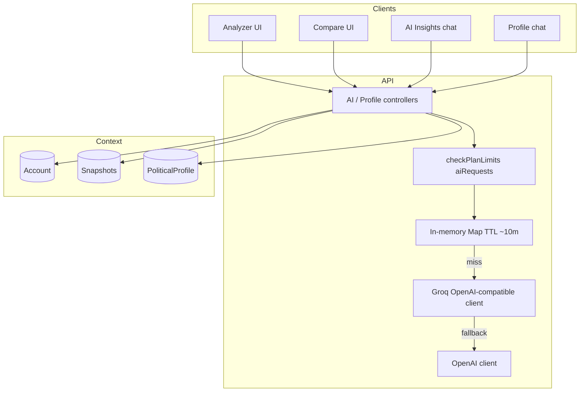

# AI Documentation

> Sources: `controllers/aiController.js`, `services/aiInsightService.js`, `aiChannelInsightService.js`, `aiCompareService.js`, `aiPoliticalSummaryService.js`, profile chat routes, `GROQ_API_KEY` / `OPENAI_API_KEY`.

---

## AI Architecture



### Model Selection (Current)

| Role | Provider | Model | Notes |
|------|----------|-------|-------|
| Primary | Groq | `llama-3.3-70b-versatile` | Base URL `https://api.groq.com/openai/v1`; ~10s timeout |
| Fallback | OpenAI | `gpt-4o-mini` | Used when Groq fails / unavailable |
| Required env | `GROQ_API_KEY` | — | Boot fails if missing |
| Optional env | `OPENAI_API_KEY` | — | Enables fallback |

Uses the official `openai` npm SDK pointed at Groq’s compatible API for the primary path.

---

## Prompt Flow

1. Client sends structured metrics or chat messages  
2. Middleware authenticates + applies plan limits where configured  
3. Service builds system/user prompts (metrics JSON, titles, political context)  
4. Optional **RAG-style** injection: query user’s tracked accounts + recent snapshots + party aggregates  
5. Call LLM; parse structured output or stream tokens  
6. Cache successful non-stream or stream-final results where implemented  
7. Persist insights into profiles/reports when auto-save/hub indexing runs  

---

## LLM Usage Surfaces

| Endpoint / feature | Auth | Plan gate | Output |
|--------------------|------|-----------|--------|
| `POST /api/ai/video-insights` | Yes | `aiRequests` | Structured video insights |
| `POST /api/ai/chat` | Yes | `aiRequests` | **SSE** political research chat |
| `POST /api/ai/channel-insights` | Yes | (route-level protect) | Channel strategy insights |
| Compare services | Via compare APIs | — | AI comparison narrative |
| Profile AI modules | `/api/profile/...` | protect | Summaries, insights, chat |
| Political summary service | Internal | — | Profile dossier text |

---

## Fallback Mechanism

```text
try Groq (primary)
  → on auth/rate/network/timeout errors
try OpenAI (if OPENAI_API_KEY present)
  → else return controlled error ("AI services currently unavailable")
```

Controllers map provider HTTP failures to appropriate API status codes (401 key issues, 429 rate limits, 400 bad prompts).

---

## Caching

- **In-memory `Map`** caches for repeated AI prompts (approx **10 minute** TTL in AI controllers/services)
- Cache keys derived from prompt/history fingerprints
- **Not shared** across multiple Node processes (see recommendations)

YouTube/X response caches (`YoutubeCache`, `XCache`) reduce upstream cost before AI runs.

---

## Rate Limiting & Quota Management

**HTTP:** AI routes sit behind `strictLimiter` (250 / 15 min) plus global API limiter.

**Plan quotas** (`Usage.aiRequestsCount` vs `PLAN_LIMITS`):

| Plan | maxAiRequestsCount / cycle |
|------|----------------------------|
| free | 3 |
| professional | 100 |
| enterprise | 10000 |

Incremented when gated AI endpoints succeed through `checkPlanLimits('aiRequests')`.

**YouTube API quota** tracked separately in `ApiUsage` (not LLM quota).

---

## Streaming

- Political research chat (`POST /api/ai/chat`) and profile chat use **Server-Sent Events (SSE)**
- Frontend reads `ReadableStream`, parses `data: ` lines, appends tokens to chat UI
- Stop/cancel controlled from client UI (abort where wired)

---

## Context Building / RAG Flow

**Applicable:** Yes, for strategy chat — not a vector DB RAG stack.

Current pattern:

1. Load user’s YouTube `Account` documents  
2. Load recent snapshots (e.g., last 30 days)  
3. Compute growth / engagement aggregates and party rollups  
4. Inject factual context into the system prompt  
5. Keep short chat history window (e.g., last ~6 messages)

There is **no** embedding index / Pinecone / pgvector in this repository.

---

## Prompt Safety Notes (Current)

- Inputs sanitized by global XSS/mongo sanitizers before controllers  
- Metrics-oriented prompts reduce free-form injection surface vs arbitrary tool-calling agents  
- No arbitrary tool-execution agent loop in production code paths reviewed  

---

## Recommended Improvements (Not Current)

- Shared Redis AI response cache  
- Token usage metering & cost dashboards  
- Prompt/version registry with eval harness  
- True vector RAG over news + dossier chunks if recall quality requires it  
- Per-user concurrency caps independent of HTTP rate limits  
- Structured output JSON schema validation on every AI response  
