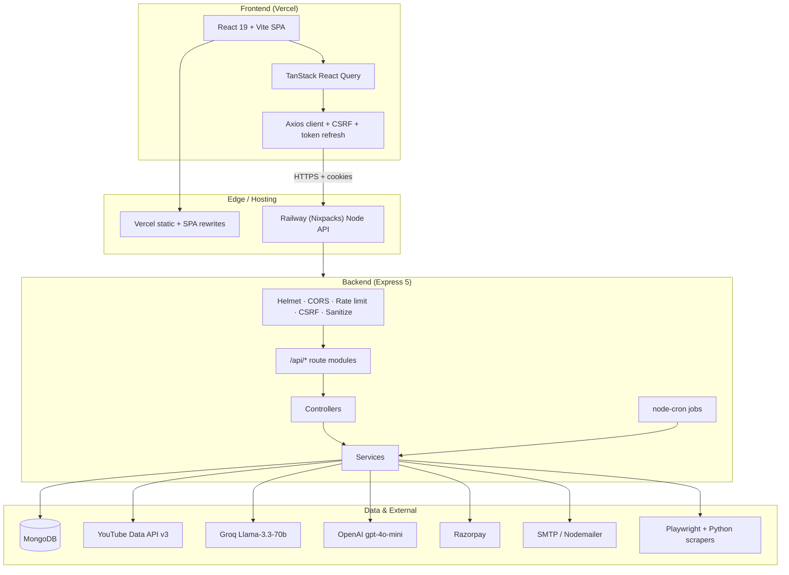
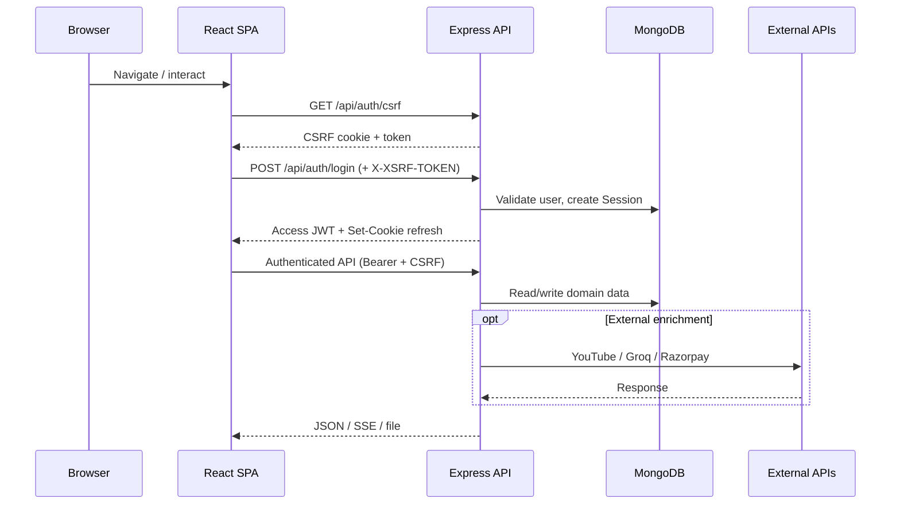
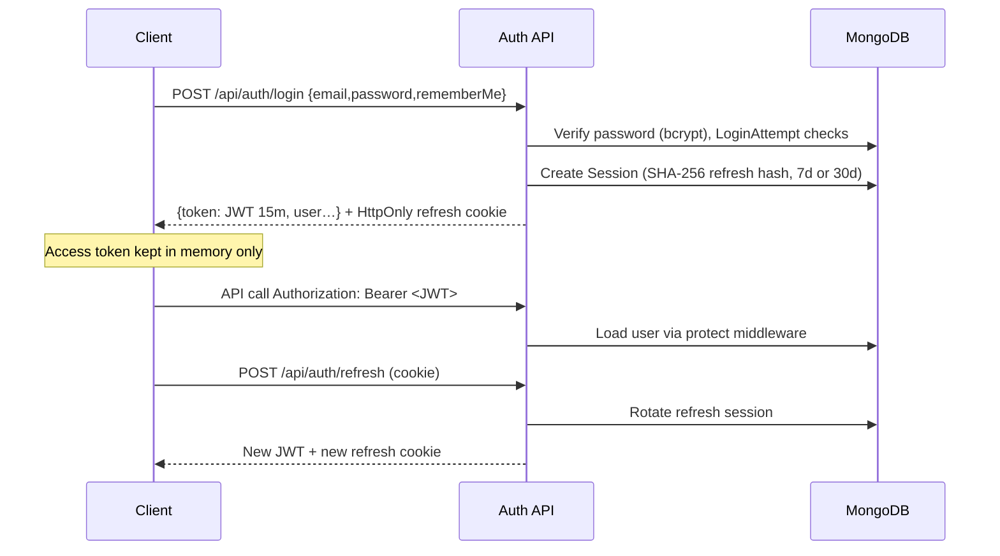
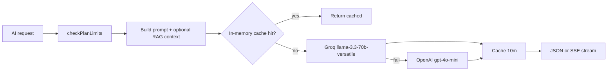
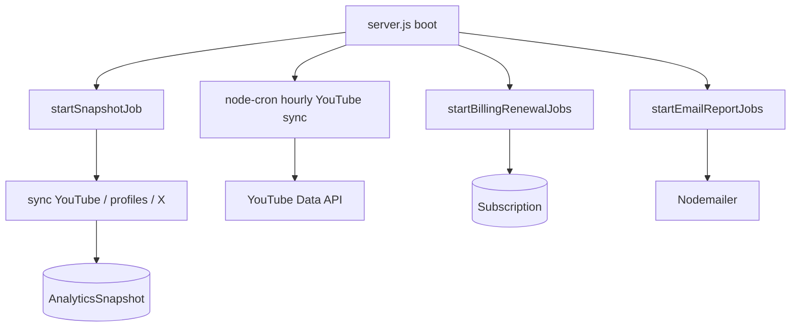
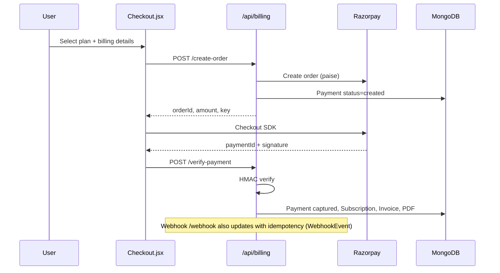

# Architecture Documentation

> Based on the actual SocialIQ codebase (`backend/`, `frontend/`).  
> Last reviewed against: Express 5 + Mongoose 9 + React 19 + Vite 8.

---

## 1. Executive Summary

### Project Overview

**SocialIQ** (repository: Social-Analysis) is a full-stack **AI political intelligence and social media analytics** platform. It aggregates YouTube (and X) creator metrics, builds political dossiers, runs AI analysis, and exposes an Intelligence Hub for reports, billing, and research workflows.

### Business Problem

Political researchers, journalists, and campaign teams must manually stitch together YouTube metrics, news, election history, and narrative context. Existing analytics tools optimize for commercial KPIs, not party/state influence, sentiment, or election intelligence.

### Solution

SocialIQ provides:

- Tracked creator accounts with automated YouTube sync and analytics snapshots
- Political profile dossiers (biography, timeline, elections, influence, news sentiment)
- Groq-primary / OpenAI-fallback AI insights with RAG-style DB context injection
- Subscription billing via Razorpay (INR + GST)
- Exportable Intelligence Hub reports (PDF/Excel/JSON/share links)

### Target Users

- Journalists and news agencies
- Political researchers and analysts
- Campaign managers and strategists
- Organizations studying digital political reach

### Key Features (Implemented)

| Area | Implementation |
|------|----------------|
| Auth | JWT access (15m) + refresh cookies + CSRF + Google OAuth |
| Analyzer | YouTube URL analysis; X profile analysis |
| Analytics | Append-only `AnalyticsSnapshot` time series, dashboard APIs |
| Profiles | `PoliticalProfile` modules + AI chat (SSE) |
| AI | Video/channel insights, compare reports, strategy chat |
| Reports | Save/upsert/share/regenerate/export |
| Billing | Razorpay orders, webhooks, invoices, coupons, plan limits |
| Jobs | Snapshot cron, hourly YouTube sync, billing renewal, email reports |

### High-Level Architecture



---

## 2. System Architecture

### Runtime Topology (Current)

| Component | Technology | Deploy target (current) |
|-----------|------------|-------------------------|
| Frontend | React 19, Vite 8, Tailwind 4, Framer Motion, Recharts | Vercel (`frontend/vercel.json`) |
| Backend | Node.js 20, Express 5, ESM | Railway (`railway.json` + `nixpacks.toml`) |
| Database | MongoDB via Mongoose 9 | External MongoDB (Atlas or equivalent) |
| Payments | Razorpay | Live/test keys via env |
| AI | Groq primary, OpenAI fallback | API keys via env |
| Scraping | Playwright Chromium; Python `twscrape`/`twikit` | Installed in Nixpacks/postinstall |

### Request Flow



---

## 3. Frontend Architecture

**Entry:** `frontend/src/main.jsx` → `App.jsx`  
**Routing:** React Router v7; all pages `React.lazy` + Suspense  
**Auth state:** `AuthContext` (in-memory access token)  
**Appearance:** `AppearanceContext` (local + `/api/settings/appearance`)  
**Server state:** TanStack React Query (`hooks/useQueries.js`)  
**HTTP:** `api/client.js` (credentials, CSRF, 401 refresh, GET dedupe, retries)

### Route Map (from `App.jsx`)

| Path | Auth | Page |
|------|------|------|
| `/`, `/pricing`, `/login`, `/register`, `/forgot-password`, `/reset-password` | Public | Landing / auth |
| `/shared/:token` | Public | Shared report |
| `/dashboard`, `/analyzer`, `/compare`, `/ai-insights`, … | Protected | App shell routes |
| `/profile/:creatorId` | Protected | Political profile |
| `/billing/*` | Protected | Plans, checkout, invoices |
| `/error/*` | Public | Error pages |

### Layering

```
pages/          → route-level screens
components/     → UI (layout, dashboard, profile, reports, settings, charts)
hooks/          → useDebounce, React Query hooks
context/        → Auth, Appearance
api/            → Axios wrappers per domain
utils/          → formatting, auto-save reports, image URLs
errors/         → ErrorBoundary + HTTP error pages
config/         → metricColors, partyThemes
```

---

## 4. Backend Architecture

**Entry:** `backend/server.js`

Startup order (non-test):

1. `validateEnv()` — requires `MONGO_URI`, `GROQ_API_KEY`, `JWT_SECRET`, YouTube key(s)
2. `connectDB()` — MongoDB with reconnect
3. Start jobs: snapshots, email reports, billing renewal; hub index backfill
4. Mount middleware + routes
5. Hourly YouTube sync cron
6. Listen on `PORT` (default `5000`)

### Layering

```
routes/         → HTTP path + middleware composition
controllers/    → Request/response orchestration
services/       → Business logic (auth, AI, billing, reports, analytics, …)
repositories/   → Session / CSRF / User data access helpers
models/         → Mongoose schemas
middleware/     → Auth, CSRF, billing limits, validation, cache, sanitize
jobs/           → Cron workers
providers/      → Scrapers / external data providers
utils/          → JWT, crypto, YouTube client, logging helpers
```

---

## 5. Database Architecture

- **ODM:** Mongoose 9
- **Style:** Document models with compound indexes; TTL indexes on sessions/CSRF
- **Analytics:** Append-only `AnalyticsSnapshot` (primary time series); legacy `Snapshot` retained
- **Multi-tenancy:** Most collections scoped by `userId`

See [Database.md](./Database.md) for fields, indexes, and ER diagram.

---

## 6. Authentication Flow



**Details**

- Access JWT payload: `{ id: userId }`, expiry `15m` (`utils/jwt.js`)
- Refresh: opaque 40-byte token, hashed at rest in `Session`
- Cookies: `socialiq_refresh_token` (HttpOnly); CSRF `XSRF-TOKEN` (readable)
- Optional cookie: `socialiq_access_token` accepted by `authMiddleware`
- Google Sign-In: `POST /api/auth/google` (requires `GOOGLE_CLIENT_ID` in production)

---

## 7. Authorization Flow

**Current implementation**

- Most routes: `protect` — authenticated user required
- Plan gates: `checkPlanLimits('aiRequests' | 'reports' | 'pdfExport' | tracked creators)`
- Admin helpers: `requireAdmin` / `requireRole` re-exported from `authorization.js` / `authMiddleware.js`
- Resource ownership: controllers typically filter by `req.user._id` (reports, accounts, etc.)
- Public exceptions: billing plans, appearance GET, shared report by token, Razorpay webhook

**Plan limits** (`middleware/billingMiddleware.js`):

| Plan | Creators | AI requests / cycle | Reports / cycle | PDF export |
|------|----------|---------------------|-----------------|------------|
| free | 2 | 3 | 5 | No |
| professional | 15 | 100 | 100 | Yes |
| enterprise | 1000 | 10000 | 10000 | Yes |

---

## 8. API Flow

All business APIs under `/api/*` with global `apiLimiter` (1000 / 15 min). Strict limiter (250 / 15 min) on expensive route groups. Auth limiter (30 / 15 min) on `/api/auth`.

See [API.md](./API.md) for endpoint contracts.

---

## 9. AI Pipeline



See [AI.md](./AI.md).

---

## 10. Background Jobs

| Job | Schedule | File | Purpose |
|-----|----------|------|---------|
| Snapshots | Daily / weekly / monthly midnight | `jobs/snapshotJob.js` | Sync + snapshot analytics |
| YouTube sync | Hourly `0 * * * *` | `jobs/youtubeSyncJob.js` (+ server cron) | Channel metric refresh |
| Billing renewal | Daily 09:00 | `jobs/billingRenewalJob.js` | Reminders, expiry, downgrades |
| Email reports | Per `EmailSchedule` | `jobs/emailReportJob.js` | Scheduled digests |

Jobs are skipped in test mode.

---

## 11. Scheduler / Cron Flow



---

## 12. Payment Flow



Prices (INR ex-GST): Professional ₹2400/mo · ₹24000/yr; Enterprise ₹8200/mo · ₹82000/yr. GST 18%.

---

## 13. Report Generation Flow

1. Domain events / UI call `reportApi` → `POST /api/reports` or `/upsert`
2. `reportService` persists `SavedReport` (+ optional dossier assembly)
3. Regenerate: `POST /:id/regenerate` (rate limited)
4. Share: token on `shareToken`; public `GET /api/shared/:token`
5. Export: `GET /api/exports/reports/:id` (PDFKit / xlsx)
6. Audit: `ReportAuditLog`

---

## 14. Analytics Flow

1. YouTube sync / analyzer / snapshot job writes metrics
2. `analyticsEngine.captureSnapshot` appends `AnalyticsSnapshot` (skips duplicates)
3. Dashboard/profile charts read series via `/api/analytics/*`
4. Frontend React Query caches with stale times (2–15 minutes typical)
5. Backend short response cache (20–30s) on accounts/analytics/history/groups

---

## 15. Folder Structure (Important Paths)

### Backend

| Folder | Purpose | Responsibilities | Key interactions |
|--------|---------|------------------|------------------|
| `config/` | Env, DB, plans | Startup validation, Mongo connect, plan catalog | Used by `server.js`, billing |
| `controllers/` | HTTP handlers | Map req → services → res | Called by routes |
| `services/` | Domain logic | Auth, AI, billing, reports, YouTube, profiles | Uses models/providers |
| `repositories/` | Persistence helpers | Session/CSRF/User CRUD abstractions | Used by auth/token services |
| `middleware/` | Cross-cutting | Auth, CSRF, limits, validation, cache | Mounted in routes/server |
| `routes/` | URL map | Wire middleware + controllers | Mounted in `server.js` |
| `models/` | Schemas | Validation, indexes, refs | Used everywhere |
| `jobs/` | Cron | Background sync/billing/email | Started from `server.js` |
| `providers/` | Scrapers | Wikipedia/ECI/party/news enrichment | Profile build pipeline |
| `utils/` | Shared helpers | JWT, crypto, YouTube client | Services/middleware |
| `tests/` | Jest suites | API/unit/integration coverage | `npm test` |
| `storage/` | Uploads | Invoice PDFs etc. | Served at `/uploads` |

### Frontend

| Folder | Purpose | Responsibilities | Key interactions |
|--------|---------|------------------|------------------|
| `pages/` | Screens | Feature UX | Routes in `App.jsx` |
| `components/` | UI building blocks | Layout, charts, reports | Used by pages |
| `hooks/` | Reusable logic | Debounce, React Query | Pages/components |
| `context/` | Global client state | Auth, appearance | Wrap app |
| `api/` | HTTP adapters | Endpoint functions | Hooks + pages |
| `config/` | Static theme/metrics | Colors, party themes | Charts/UI |
| `assets/` / `public/` | Static media | Logos, favicon | Vite public |
| `errors/` | Failure UX | Boundaries, HTTP error pages | Router |
| `utils/` | Pure helpers | Dates, auto-save, images | Across UI |

---

## Recommended Improvements (Not Current)

- Dedicated `/health` and `/ready` probes with DB ping
- Move CI workflows from `workflows/` into `.github/workflows/` (this repo now adds the latter)
- Centralized OpenTelemetry tracing (not implemented)
- Redis for shared rate-limit / CSRF / AI cache across instances
- TypeScript migration for stronger contracts
