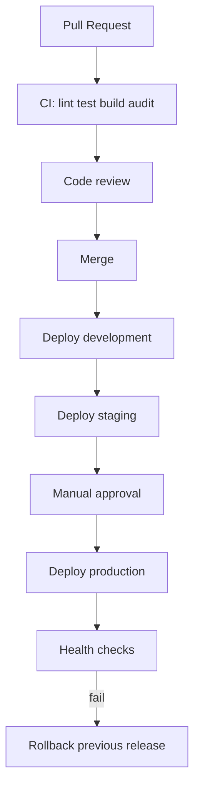

# CI/CD Documentation

## Current State (Before This Hardening)

- Informal workflows lived under `workflows/frontend.yml` and `workflows/backend.yml` (not under `.github/workflows/`, so GitHub Actions may not have picked them up automatically).
- Deployments: **Railway** (API via Nixpacks) + **Vercel** (frontend).
- No Docker-based CD in repository historically.

## Target Pipelines (Added)

| Workflow | Path | Triggers |
|----------|------|----------|
| Continuous Integration | `.github/workflows/ci.yml` | Push + PR |
| Continuous Deployment | `.github/workflows/cd.yml` | Branch deploys + environment gates |
| Security | `.github/workflows/security.yml` | Schedule + PR/push |
| Release | `.github/workflows/release.yml` | Tags `v*` |



---

## Continuous Integration (`ci.yml`)

Runs on push/PR:

1. Checkout  
2. Setup Node 20  
3. `npm ci` (backend + frontend)  
4. Lint backend & frontend  
5. Backend unit/integration tests (`npm test`)  
6. Frontend Vitest (`npx vitest run`) when present  
7. Frontend production build  
8. Backend build script  
9. `npm audit` (non-blocking or warn per config)  
10. Upload build artifacts  

> TypeScript typecheck is **not applicable** — the codebase is JavaScript. The workflow documents this explicitly rather than inventing `tsc`.

---

## Continuous Deployment (`cd.yml`)

Branch mapping (conventional):

| Branch | Environment | Gate |
|--------|-------------|------|
| `development` | development | Auto after CI |
| `staging` | staging | Auto after CI |
| `main` / `production` | production | **GitHub Environment approval** |

Deploy actions use repository secrets:

- `RAILWAY_TOKEN` / project IDs (or deploy hooks)
- `VERCEL_TOKEN`, `VERCEL_ORG_ID`, `VERCEL_PROJECT_ID`
- Environment-specific API URLs

**Health check:** `curl` against `GET /` (and optionally CSRF) after deploy.

**Rollback:** Re-deploy previous Git SHA / Railway previous deployment; see [Deployment.md](./Deployment.md).

---

## Security Workflow (`security.yml`)

- Dependency audit (`npm audit`)
- Secret scan (Gitleaks action)
- Optional CodeQL (if enabled on repo)

---

## Release Workflow (`release.yml`)

On tag `vX.Y.Z`:

- Build artifacts  
- Create GitHub Release with CHANGELOG excerpt  
- Optionally promote production deploy  

---

## Local Parity

```bash
cd backend && npm run lint && npm test
cd frontend && npm run lint && npm run build && npx vitest run
```

---

## Recommended Improvements

- Require CI green before merge (branch protection)
- Separate worker dyno so CD does not double-schedule cron
- SBOM generation (CycloneDX) on release
- OIDC deploy to cloud without long-lived tokens
