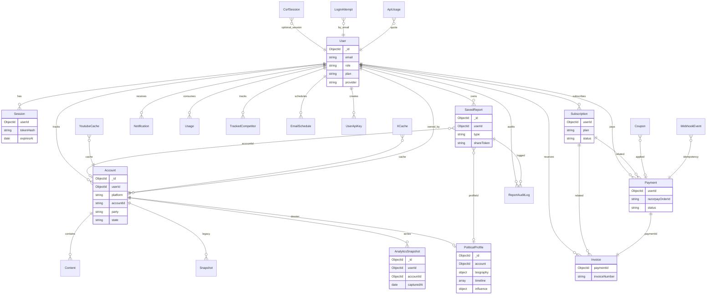

# Database Documentation

> Source of truth: `backend/models/*.js`  
> Database: **MongoDB** via **Mongoose 9**

---

## Overview

SocialIQ uses a multi-tenant document model. Most collections are scoped by `userId`. Analytics use an **append-only** time-series collection (`AnalyticsSnapshot`). Sessions and CSRF tokens use **TTL indexes** for automatic cleanup.

---

## ER Diagram

---

## Collections / Models

### User (`models/User.js`)

**Purpose:** Application identity, preferences, plan mirror, OAuth linkage.

| Field | Type | Notes |
|-------|------|-------|
| name, email | String | email unique, lowercase |
| passwordHash | String | required for `provider=local` |
| avatar | String | |
| role | Enum | `user`, `admin` |
| plan | Enum | `free`, `pro`, `enterprise` |
| provider | Enum | `local`, `google` |
| googleId | String | sparse |
| notificationPreferences | Object | growthSpike, newAiReport, … |
| appearancePreferences | Object | theme, accent, fontSize, … |
| privacyPreferences / securityPreferences / advancedPreferences | Object | settings panels |
| integrations | Object | youtube, twitter, … |
| passwordHistory | [String] | |
| verification / reset tokens | String + Date | email verify & password reset |
| bio, username, phone, organization, … | String | profile fields |
| lastLogin, loginHistory | Date / [Object] | last 10 logins via service |

**Indexes:** `createdAt`, `emailVerificationToken`, `passwordResetToken`, unique email.

**Lifecycle:** Created on register/Google; updated via settings/users; deleted via account deletion.

---

### Session (`models/Session.js`)

**Purpose:** Refresh-token sessions (hashed).

| Field | Notes |
|-------|-------|
| userId | Ref User, indexed |
| tokenHash | SHA-256, unique |
| familyId | Rotation family |
| browser, device, os, ipAddress, userAgent | Request meta |
| expiresAt | TTL index |
| revoked, replacedByToken | Rotation / logout |

**Indexes:** `{userId, revoked, expiresAt}`, TTL on `expiresAt`.

**Lifecycle:** Created login/register; rotated on refresh; revoked on logout; TTL deletes expired.

---

### CsrfSession (`models/CsrfSession.js`)

**Purpose:** Server-side CSRF token store (double-submit pattern).

| Field | Notes |
|-------|-------|
| sessionId | Unique opaque id |
| csrfToken | Server token |
| expiresAt | TTL ~30 days |

---

### Account (`models/Account.js`)

**Purpose:** Tracked social creator per user.

| Key fields | Notes |
|------------|-------|
| userId, createdBy | Multi-tenant ownership |
| platform | `youtube`, `instagram`, `x` |
| accountId | Platform id; unique with userId |
| name, profileUrl, thumbnail, metrics | subscribers, views, videos, engagement |
| party, state, group | Political tagging |
| isCompetitor, isActive | Flags |
| recentVideos, cacheExpiresAt, channelId | Sync helpers |

**Indexes:** Unique `{accountId, userId}`; filters on party/state/group/platform; `normalizedUrl`, `channelId`, `cacheExpiresAt`.

---

### Content (`models/Content.js`)

**Purpose:** Per-account videos/shorts.

Unique `{contentId, userId}`; indexes for views and publishedAt.

---

### Snapshot (`models/Snapshot.js`) — Legacy

**Purpose:** Older analytics point-in-time records. Prefer `AnalyticsSnapshot` for graphs.

---

### AnalyticsSnapshot (`models/AnalyticsSnapshot.js`)

**Purpose:** **Append-only** analytics time series (source of truth for charts).

| Groups | Fields |
|--------|--------|
| Identity | userId, accountId, capturedAt, source |
| YouTube metrics | subscribers, views, videos, likes, comments, engagementRate, … |
| Political metrics | politicalReach, digitalPresence, mediaVisibility, electionStrength, influenceScore, sentiment* |
| Denormalized | party, state, name, profileImage |

**Indexes:** `{accountId, capturedAt}`, `{userId, capturedAt}`, compound user+account+time.

**Lifecycle:** Written by sync/snapshot/profile build; never mutated as a series (append-only design).

---

### PoliticalProfile (`models/PoliticalProfile.js`)

**Purpose:** Large political intelligence dossier for a creator/account.

Major embedded sections: `biography`, `timeline`, `elections`, `facts`, `verifiedFacts`, `relationships`, `influence`, `news`, `newsSentiment`, `geographicReach`, `audienceAnalytics`, `aiInsights`, `sources`, sync metadata and version fields (`builderVersion`, `profileSchemaVersion`, …).

**Indexes:** syncStatus + lastSyncAttemptAt; schema/builder versions.

---

### SavedReport (`models/SavedReport.js`)

**Purpose:** Intelligence Hub documents.

Types include: `political_profile`, `ai_insight`, `comparison`, `election`, `timeline`, `news_sentiment`, `influence`, `telemetry`, `snapshot`, `analysis`, `competitor_report`, `custom`.

**Sharing:** `shareToken` (unique sparse), `visibility`, `shareExpiresAt`, `shareRevokedAt`.

**Indexes:** user+createdAt, pinned/favorite, type, status, text index on title/summary/tags/keywords/source.

---

### Subscription (`models/Subscription.js`)

Plans: `free`, `professional`, `enterprise`.  
Status: `active`, `cancelled`, `expired`, `past_due`, `trialing`.  
Billing cycle: `monthly`, `annual`, or null.  
Provider field supports `razorpay` (primary implementation).

---

### Payment (`models/Payment.js`)

Razorpay order/payment tracking; amounts include subtotal, discount, gst; unique `razorpayOrderId`.

---

### Invoice (`models/Invoice.js`)

One invoice per payment (`paymentId` unique); `invoiceNumber` unique; PDF path/url fields.

---

### Usage (`models/Usage.js`)

Per-user billing-cycle counters: `analysesCount`, `aiRequestsCount`, `reportsCount`.

---

### Notification (`models/Notification.js`)

Types: `info`, `warning`, `spike`, `milestone`, `ai_insight`. Index `{userId, isRead, createdAt}`.

---

### TrackedCompetitor (`models/TrackedCompetitor.js`)

Unique `{userId, platform, accountId}` for youtube/x competitors.

---

### LoginAttempt (`models/LoginAttempt.js`)

Brute-force ledger: unique `{email, ipAddress}`; lockout after repeated failures (auth service: 5 attempts → lockout window).

---

### Coupon (`models/Coupon.js`)

Promo codes (percent/amount off, plan/cycle limits). Builtin codes also in `config/plans.js`.

---

### UserApiKey (`models/UserApiKey.js`)

Hashed developer API keys with prefix, permissions (`read` / `read_write`), expiry/revoke.

---

### EmailSchedule (`models/EmailSchedule.js`)

Scheduled digests: frequency `daily|weekly|monthly`; reportTypes `competitor|growth|ai`.

---

### XCache / YoutubeCache

Response caches for X profiles and YouTube payloads.

---

### ApiUsage

YouTube API quota accounting (apiKey, endpoint, quotaCost, cached flag).

---

### WebhookEvent

Payment webhook idempotency ledger (`eventId` unique).

---

### ReportAuditLog

Report actions: created, viewed, exported, shared, revoked, deleted, updated, favorited, pinned, regenerated.

---

## Relationships Summary

- **User 1→N** Accounts, Sessions, Reports, Notifications, Competitors, Usage, Subscriptions, Payments, Invoices  
- **Account 1→N** Content, AnalyticsSnapshots; **1→0..1** PoliticalProfile (logical via account linkage in profile pipeline)  
- **Payment 1→1** Invoice  
- **SavedReport** optionally links `profileId` / `accountId`

---

## Constraints & Invariants

- Refresh tokens stored **hashed only**
- Plan enforcement reads `Subscription` + `Usage` / Account counts
- Shared reports require valid non-revoked `shareToken`
- Webhook processing must be idempotent via `WebhookEvent`

---

## Recommended Improvements (Not Current)

- Explicit Mongoose ref from `PoliticalProfile` → `Account` documented in all code paths
- TTL/archival policy for old `AnalyticsSnapshot` documents at scale
- Separate read replicas for analytics-heavy queries
