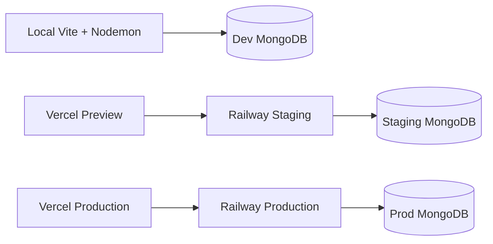
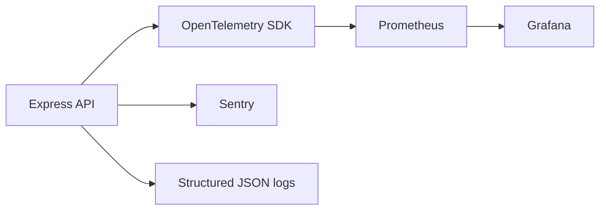
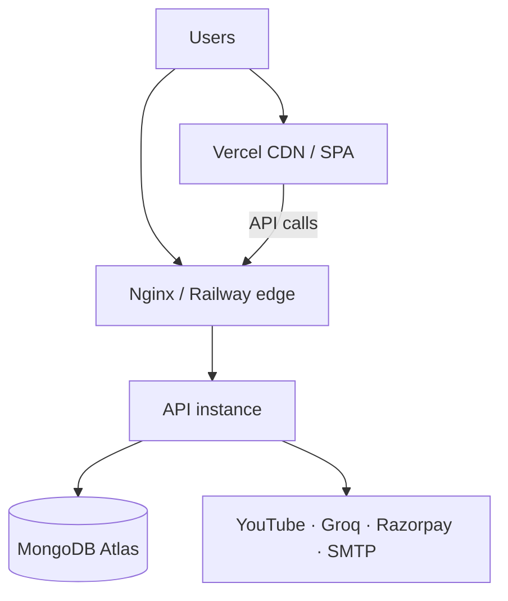

# Deployment Documentation

> Current production topology inferred from `railway.json`, `nixpacks.toml`, `frontend/vercel.json`, and env usage.

---

## Environment Separation

| Environment | Frontend | Backend | Database |
|-------------|----------|---------|----------|
| Development | Vite `npm run dev` (:5173) | `npm run dev` (:5000) | Local or Atlas |
| Staging | Vercel preview / staging project | Railway staging service | Staging MongoDB |
| Production | Vercel production | Railway production | Production MongoDB |



---

## Environment Variables

### Backend (required)

| Variable | Required | Purpose |
|----------|----------|---------|
| `MONGO_URI` | Yes | MongoDB connection string |
| `GROQ_API_KEY` | Yes | Primary LLM |
| `JWT_SECRET` | Yes | ≥32 chars |
| `YOUTUBE_API_KEY` or `YOUTUBE_API_KEY_*` | Yes | YouTube Data API |

### Backend (important optional)

| Variable | Purpose |
|----------|---------|
| `PORT` | Default `5000` |
| `NODE_ENV` | `development` / `test` / `production` |
| `OPENAI_API_KEY` | LLM fallback |
| `GOOGLE_CLIENT_ID` | Google Sign-In (warned if missing in production) |
| `RAZORPAY_KEY_ID` / `RAZORPAY_KEY_SECRET` / `RAZORPAY_WEBHOOK_SECRET` | Payments |
| `EMAIL_HOST` / `EMAIL_PORT` / `EMAIL_USER` / `EMAIL_PASS` / `EMAIL_FROM` | Nodemailer |
| `CLIENT_URL` / `FRONTEND_URL` | Frontend origin for emails/CORS alignment |
| `API_PUBLIC_URL` | Public API URL |
| `CSRF_MEMORY_ONLY` | Dev CSRF memory mode |
| `YT_DEBUG` | YouTube debug logs |

Create `backend/.env` from [backend/.env.example](../backend/.env.example).

### Frontend

| Variable | Purpose |
|----------|---------|
| `VITE_API_URL` | API base URL |
| `VITE_RAZORPAY_KEY_ID` | Razorpay checkout key |

See `frontend/.env.example`.

---

## Development

```bash
# Database: ensure MongoDB reachable

cd backend
cp .env.example .env   # fill secrets
npm install
npm run dev            # nodemon server.js

cd ../frontend
cp .env.example .env
npm install
npm run dev            # http://localhost:5173
```

**Notes**

- Backend `postinstall` may install Python packages (`twscrape`, `twikit`) and Playwright Chromium.
- CORS allows localhost Vite origins in development.

---

## Staging

1. Provision staging MongoDB; set all required env vars on Railway staging.
2. Set `CLIENT_URL` / CORS whitelist to staging frontend URL (code currently hardcodes production Vercel origin — update whitelist when adding staging hosts).
3. Deploy backend via Railway (Nixpacks builds `backend`, start: `cd backend && node server.js`).
4. Deploy frontend to Vercel preview with `VITE_API_URL` pointing at staging API.
5. Use Razorpay **test** keys.
6. Smoke-test: `/`, login, analyzer, billing test order, AI chat.

---

## Production

### Current platform steps

**Backend (Railway)**

- Builder: Nixpacks (`nixpacks.toml`: Node 20, Python 3, Playwright)
- Start: `cd backend && node server.js`
- Watch: `backend/**`
- Restart policy: `ON_FAILURE`

**Frontend (Vercel)**

- Build: `npm run build` in `frontend/`
- SPA rewrites: all routes → `index.html` (`vercel.json`)
- Env: `VITE_API_URL`, `VITE_RAZORPAY_KEY_ID`

### Build steps (generic / Docker)

```bash
# Backend image
docker build -f Dockerfile.backend -t socialiq-api .

# Frontend image (nginx serves static)
docker build -f Dockerfile.frontend -t socialiq-web .

# Compose prod
docker compose -f docker-compose.prod.yml up -d
```

See root Dockerfiles and [CI-CD.md](./CI-CD.md).

---

## Health Checks

| Check | How |
|-------|-----|
| Process up | `GET /` returns success JSON |
| Auth path | `GET /api/auth/csrf` |
| DB | Indirect — failed boot if `MONGO_URI` invalid; **no** `/ready` yet |
| Frontend | HTTP 200 on `/` from Vercel/nginx |

**Recommended:** add `/health` (liveness) and `/ready` (Mongo ping) for orchestrators.

---

## Rollback Strategy

### Railway / Vercel (current)

1. Revert to previous successful deployment in Railway dashboard  
2. Revert Vercel deployment / redeploy previous Git SHA  
3. Ensure MongoDB schema is backward compatible (prefer additive migrations)  
4. If payment webhooks raced, reconcile via `WebhookEvent` / invoice records  

### Docker / Compose

```bash
docker compose -f docker-compose.prod.yml pull  # previous tags
# or redeploy known-good image digests
docker compose -f docker-compose.prod.yml up -d
```

Keep previous image tags (`:sha-abc`, `:previous`).

---

## Secrets Management

**Current:** Host environment variables (Railway/Vercel secrets). Never commit `.env`.

**Recommended:** Rotate `JWT_SECRET` and Razorpay/YouTube/Groq keys on schedule; use a secrets manager; restrict production dashboard access with 2FA.

---

## Deployment Verification Checklist

- [ ] `GET /` OK  
- [ ] Register/login + refresh cookie  
- [ ] CSRF mutation works  
- [ ] YouTube analyze with valid API key  
- [ ] AI endpoint with Groq key  
- [ ] Razorpay test/live verify + webhook  
- [ ] Cron jobs running (check logs)  
- [ ] Frontend talks to correct `VITE_API_URL` over HTTPS  

---

## Nginx (optional self-host)

Use `nginx/nginx.conf` for TLS termination, gzip, security headers, `/api` reverse proxy, and static frontend. See comments in that file.

---

## Monitoring, Logging, Metrics & Tracing

### Current Implementation

| Concern | Status |
|---------|--------|
| Logging | `console` logs in API; `securityLogger` for auth events |
| Health | `GET /` liveness message only |
| Metrics | No Prometheus exporters in-app |
| Tracing | No OpenTelemetry SDK wired |
| Error tracking | No Sentry SDK in dependencies |
| Uptime | Rely on Railway/Vercel platform dashboards |

### Recommended Stack (Not Wired Yet)



1. Add `/health` + `/ready`  
2. Emit Prometheus metrics (RPS, latency, cron success, YouTube quota)  
3. Grafana dashboards for API and job health  
4. Sentry for frontend + backend exceptions  
5. OpenTelemetry traces across Express handlers and outbound Axios/OpenAI calls  

---

## DevOps & Infrastructure Overview

### Production deployment diagram (current + optional Docker)



### Environment separation

See table at top of this document. Keep separate MongoDB, Razorpay mode (test/live), and JWT secrets per environment.

### Secrets management

**Current:** Platform env vars.  
**Recommended:** Vault / cloud secret manager + short-lived deploy credentials (OIDC).

### Release strategy

Tag releases (`vX.Y.Z`) via `.github/workflows/release.yml`. Promote `development` → `staging` → `main` with CI gates.

### Blue-green / canary (Recommended)

Not implemented on Railway/Vercel by default in this repo. Recommended patterns:

- **Blue-green:** Two Railway services; switch public domain after health checks  
- **Canary:** Send a percentage of traffic to a new Railway deployment via edge weighted routing  

### Disaster recovery & backups

| Item | Current | Recommended |
|------|---------|-------------|
| MongoDB backups | Atlas provider backups if enabled | Daily snapshots + PITR; quarterly restore drills |
| Object files (`storage/uploads`) | Local disk on API host | Object storage (S3) + versioning |
| Secrets loss | Manual rotation | Runbook in incident channel |
| RTO / RPO | Undefined | Define with stakeholders |

### Testing documentation pointer

Unit/integration/API tests live under `backend/tests` (Jest + Supertest). Frontend component tests under `frontend/src/tests` (Vitest). E2E Playwright folders may exist for experiments; CI currently emphasizes Jest + Vitest + build. Coverage is not enforced in `jest.config.js` (`collectCoverage: false`) — enabling thresholds is a recommended improvement.
