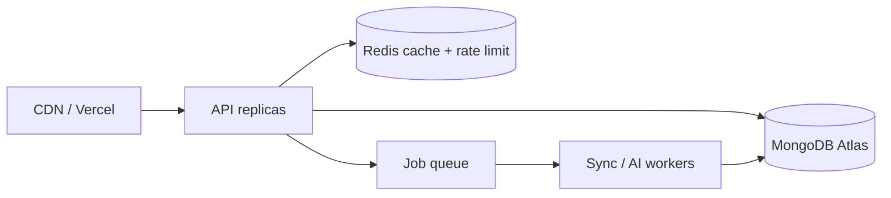

# Performance Documentation

> Based on actual frontend and backend implementations.

---

## Current Optimizations

### Caching

| Layer | Mechanism | TTL / notes |
|-------|-----------|-------------|
| Backend GET cache | `responseCache` middleware | ~20s accounts/groups; ~30s analytics/history |
| ETags | Weak ETags enabled on Express | 304 support |
| AI responses | In-memory Map | ~10 minutes |
| YouTube / X | `YoutubeCache`, `XCache` models | Reduces API quota |
| React Query | Client cache | `staleTime` ~2m default; up to 15m GC; per-query overrides |
| Appearance | LocalStorage + debounced server sync | 600ms debounce |

### Lazy Loading

- All route pages use `React.lazy` in `App.jsx`
- Vite `manualChunks` splits vendor-react, vendor-query, vendor-motion, vendor-charts, vendor-utils
- Images: `SafeImage` with `loading="lazy"`, skeleton, fallback cascade

### React Query

- `refetchOnWindowFocus: false`
- Exponential retry (skip most 4xx)
- `placeholderData` keeps previous data while refetching
- Conditional `enabled` flags (e.g., profile tab-only fetches)
- Query invalidation after analyzer/mutations

### Memoization

- `React.memo` on selected heavy components (SafeImage, report previews, timeline, appearance, …)
- `useMemo` / `useCallback` in billing/checkout and data-heavy pages where present

### Background Jobs

- Heavy sync moved off request path: hourly YouTube sync, daily/weekly/monthly snapshots
- Analyzer still synchronous to caller but benefits from caches

### Pagination

- Reports list paginated (UI uses page size ~24)
- Virtual grid for large report collections (`ReportVirtualGrid`)

### Debouncing

- `useDebounce` for search (Reports ~300ms, Navbar ~280ms)
- Appearance preference writes debounced to API

### Compression & Payload

- `compression` middleware (gzip/brotli)
- JSON body limit 10KB (DoS protection; large uploads not accepted on JSON routes)
- Frontend build minify + CSS code split

### HTTP Client

- Axios GET **deduplication** for identical in-flight requests
- Limited retries for idempotent methods on transient errors

---

## Known Bottlenecks

- In-memory caches do not share across Railway replicas
- Political profile build / scrape pipelines can be slow (Playwright + providers)
- AI chat is network-bound to Groq/OpenAI
- Large `PoliticalProfile` documents increase read cost

---

## Future Scaling Strategy (Recommended)

1. Horizontal API replicas behind load balancer / Nginx  
2. Redis for rate limits, CSRF, AI/response cache  
3. Move cron work to a dedicated worker process (avoid duplicate crons per replica)  
4. Archive cold `AnalyticsSnapshot` data  
5. Read preference / secondary for dashboard aggregations  
6. CDN cache for public shared reports where safe  

Mark these as **Recommended Improvements**, not current behavior.
