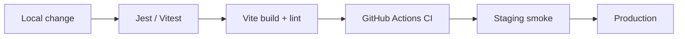

# Testing Documentation

> Sources: `backend/jest.config.js`, `backend/tests/*`, `frontend` Vitest config in `vite.config.js`, `frontend/src/tests/*`.

---

## Strategy

| Layer | Tooling | Location | When to run |
|-------|---------|----------|-------------|
| Unit / service | Jest | `backend/tests/*.test.js` | Every PR touching backend |
| API / integration | Jest + Supertest | Same | Auth, billing, reports, analytics |
| Component | Vitest + Testing Library | `frontend/src/tests/*` | UI contract / integrity tests |
| E2E | Playwright (available as backend dep / scripts) | Optional / experimental | Critical user journeys before release |
| Manual | Checklist in Deployment.md | Staging | Payments, OAuth, scrapers |



---

## Unit Testing (Backend)

```bash
cd backend && npm test
```

- Environment: Node, `--runInBand`
- `collectCoverage: false` today — enabling coverage gates is recommended
- Rate limiters and cron jobs are skipped in test mode

Notable suites: auth refactor, billing, analytics engine, report service/share/dossier, profile endpoints, influence metrics, hub index.

---

## Integration / API Testing

Supertest hits Express routes with test env vars. Prefer isolating Mongo or using patterns already in each test file. Do not point CI at production `MONGO_URI`.

---

## Component Testing (Frontend)

```bash
cd frontend && npx vitest run
```

Examples: `analyticsIntegrity.test.js`, `billingCheckout.test.js` (GST 18%), `components.test.jsx`, `timelineText.test.js`.

Add `npm test` script to `frontend/package.json` is a recommended DX improvement (CI already calls `npx vitest run`).

---

## End-to-End Testing

Playwright is a **backend** dependency (scraping + optional browser tests). There is no first-class frontend Playwright suite wired into CI today.

**Recommended:** add `frontend/e2e` with login → analyzer → report smoke against staging.

---

## Coverage Requirements

| Area | Current | Recommended target |
|------|---------|--------------------|
| Backend critical services (auth, billing, reports) | Partial suites exist | ≥70% line coverage on those modules |
| Frontend | Minimal | ≥50% on billing/auth utilities |
| CI gate | Lint + test + build | Fail on coverage drop once baseline set |

---

## PR Testing Checklist

- [ ] `backend`: lint + test  
- [ ] `frontend`: lint + vitest + build  
- [ ] New endpoint documented in `docs/API.md`  
- [ ] Plan-limit / auth behavior covered if relevant  
- [ ] No secrets in fixtures  
